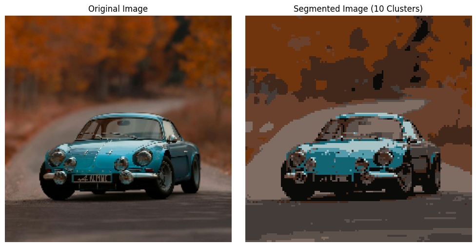

# 📦 KMeans-ImageCompressor

## Asimple and effective image compression project using K-Means Clustering.
## This project reduces the number of colors in an image by clustering similar pixels, resulting in a compressed image with minimal loss of quality.
- **🧠 Powered by unsupervised learning**
- **📷 Input: Original image**
- **🎯 Output: Compressed image with fewer colors**

